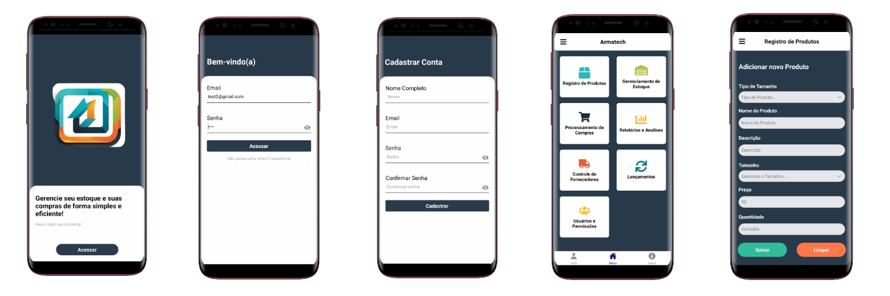
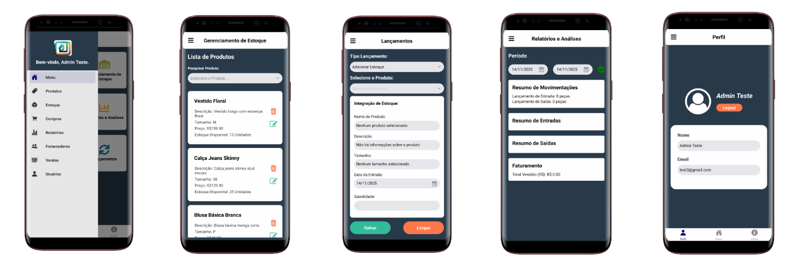

# 🏪 Armatech - Sistema de Gerenciamento de Estoque

<div align="center">


**Sistema mobile completo para gerenciamento de estoque, vendas e fornecedores**

[Características](#-características) • [Instalação](#-instalação) • [Uso](#-como-usar) • [Estrutura](#-estrutura-do-projeto) • [API](#-api-e-serviços)

</div>

---

## 📸 Screenshots

<div align="center">

### Telas do Aplicativo





</div>

---

## 📋 Sobre o Projeto

O **Armatech** é um aplicativo mobile desenvolvido em React Native com Expo, projetado para facilitar o gerenciamento completo de estabelecimentos comerciais. O sistema oferece controle de estoque, registro de vendas, gestão de fornecedores e relatórios analíticos em uma interface intuitiva e moderna.

### 🎯 Objetivo

Fornecer uma solução mobile acessível e eficiente para pequenos e médios comerciantes gerenciarem seus negócios de forma profissional, com recursos de:

- Controle de estoque em tempo real
- Registro e acompanhamento de vendas
- Gestão de fornecedores
- Relatórios financeiros e analíticos
- Controle de usuários e permissões

---

## ✨ Características

### 🔐 Autenticação

- Sistema completo de login e registro
- Armazenamento seguro de tokens com AsyncStorage
- Validação de credenciais
- Gerenciamento de sessão

### 📦 Gerenciamento de Estoque

- Listagem completa de produtos
- Cadastro de novos produtos
- Edição de produtos existentes
- Exclusão de produtos
- Filtro e busca de produtos
- Controle de quantidade disponível

### 🛒 Processamento de Vendas

- Registro de vendas
- Histórico de transações
- Controle de receitas
- Integração com estoque

### 👥 Controle de Fornecedores

- Cadastro de fornecedores
- Informações de contato
- Histórico de fornecimentos

### 📊 Relatórios e Análises

- Relatórios de vendas por período
- Análise de estoque
- Gráficos e visualizações
- Exportação de dados

### 👤 Gestão de Usuários

- Controle de permissões
- Perfis de usuário
- Gerenciamento de acessos

---

## 🚀 Instalação

### Pré-requisitos

Antes de começar, certifique-se de ter instalado:

- [Node.js](https://nodejs.org/) (versão 14 ou superior)
- [npm](https://www.npmjs.com/) ou [yarn](https://yarnpkg.com/)
- [Expo CLI](https://docs.expo.dev/get-started/installation/)
- [Git](https://git-scm.com/)

### Passo a Passo

1. **Clone o repositório**

```bash
git clone https://github.com/PROJETOS-DE-GARAGEM/Armatech.git
cd Armatech
```

2. **Instale as dependências**

```bash
npm install
```

3. **Configure a conexão com a API**

O aplicativo se conecta a uma API REST desenvolvida em Java. Configure o endereço IP da sua API nos arquivos de serviço:

Edite os arquivos:

- `service/UsuarioService.js`
- `service/CoreService.js`

Atualize o endereço da API:

```javascript
const API_URL = "http://SEU_IP:8080"; // Endereço da API Java
```

4. **Inicie o aplicativo**

```bash
npm start
```

Ou para plataformas específicas:

```bash
npm run android  # Para Android
npm run ios      # Para iOS
npm run web      # Para Web
```

---

## 📱 Como Usar

### 1. Acesso ao Sistema

**Tela de Boas-vindas**: Apresentação inicial do aplicativo

**Login**: Utilize suas credenciais cadastradas na API

**Cadastro**: Crie uma nova conta através do formulário de registro

### 2. Navegação Principal

O aplicativo possui três níveis de navegação:

#### 📌 Navegação por Abas (Bottom Tab)

- **Menu**: Tela inicial com visão geral
- **Perfil**: Informações do usuário
- **Sobre**: Informações do aplicativo

#### 📌 Menu Lateral (Drawer)

Acesse pelo ícone de menu (☰) no cabeçalho:

- 🏠 Menu Principal
- 🏷️ Registro de Produtos
- 📦 Gerenciamento de Estoque
- 🛒 Processamento de Compras
- 📊 Relatórios e Análises
- 👥 Controle de Fornecedores
- 💰 Integração de Vendas
- 👤 Usuários e Permissões

### 3. Funcionalidades Principais

#### Cadastrar Produto

1. Acesse "Registro de Produtos"
2. Preencha os campos: nome, descrição, preço, quantidade, tamanho, tipo
3. Clique em "Cadastrar"

#### Gerenciar Estoque

1. Acesse "Gerenciamento de Estoque"
2. Visualize todos os produtos cadastrados
3. Use a busca para filtrar produtos específicos
4. Clique no ícone de edição (✏️) para modificar
5. Clique no ícone de lixeira (🗑️) para excluir

#### Registrar Venda

1. Acesse "Integração de Vendas"
2. Selecione o produto
3. Informe a quantidade
4. Confirme a venda

#### Visualizar Relatórios

1. Acesse "Relatórios e Análises"
2. Selecione o período desejado
3. Visualize gráficos e estatísticas
4. Exporte os dados se necessário

---

## 📁 Estrutura do Projeto

```
Armatech/
│
├── assets/                      # Recursos estáticos
│   ├── icons/                   # Ícones do aplicativo
│   ├── images/                  # Imagens
│   └── svg/                     # Componentes SVG personalizados
│       ├── BarsSvg.js
│       ├── BoxSvg.js
│       ├── ChartBarSvg.js
│       └── ...
│
├── service/                     # Camada de serviços (Comunicação com API)
│   ├── CasdastrarProdutos.js   # Serviço de produtos
│   ├── CoreService.js           # Serviço base (CRUD genérico)
│   ├── LancamentoService.js     # Serviço de lançamentos
│   └── UsuarioService.js        # Serviço de autenticação
│
├── src/
│   ├── components/              # Componentes reutilizáveis
│   │   ├── DateRelatorio/       # Seletor de datas para relatórios
│   │   ├── DateTimePicker/      # Componente de data/hora
│   │   ├── DrawerContent/       # Conteúdo customizado do drawer
│   │   ├── Footer/              # Rodapé
│   │   ├── Header/              # Cabeçalho das telas
│   │   └── ModalEditarProduto/  # Modal de edição de produtos
│   │
│   ├── pages/                   # Telas do aplicativo
│   │   ├── CadastroConta/       # Tela de registro
│   │   ├── ControleDeFornecedores/  # Gestão de fornecedores
│   │   ├── GerencimentoDeEstoque/   # Controle de estoque
│   │   ├── IntegracaoDeVendas/      # Registro de vendas
│   │   ├── Login/               # Tela de login
│   │   ├── Menu/                # Menu principal
│   │   ├── Perfil/              # Perfil do usuário
│   │   ├── ProcessamentoDeCompras/  # Compras
│   │   ├── RegistroDeProdutos/      # Cadastro de produtos
│   │   ├── RelatoriosEAnalises/     # Relatórios
│   │   ├── Sobre/               # Informações do app
│   │   ├── UsuariosEPermissoes/     # Gestão de usuários
│   │   └── Welcome/             # Tela inicial
│   │
│   ├── routes/                  # Configuração de navegação
│   │   ├── index.js             # Rotas principais
│   │   └── BottomTabNavigator.js # Navegação inferior
│   │
│   └── styles/                  # Estilos globais
│       └── theme.js             # Tema do aplicativo
│
├── App.js                       # Componente principal
├── app.json                     # Configurações do Expo
├── babel.config.js              # Configurações do Babel
├── eas.json                     # Configurações do EAS Build
├── package.json                 # Dependências do projeto
└── README.md                    # Este arquivo
```

### 📄 Descrição dos Diretórios Principais

#### `/service` - Camada de Serviços

Contém toda a lógica de comunicação com a API Java:

- **CoreService.js**: Classe base com métodos CRUD genéricos (GET, POST, PUT, DELETE)
- **UsuarioService.js**: Autenticação JWT, login, registro e gerenciamento de tokens
- **CasdastrarProdutos.js**: Extensão do CoreService para operações com produtos
- **LancamentoService.js**: Gerenciamento de lançamentos financeiros

#### `/src/components` - Componentes Reutilizáveis

Componentes compartilhados entre várias telas:

- **Header**: Cabeçalho com título e botão de menu
- **Footer**: Rodapé personalizado
- **ModalEditarProduto**: Modal para edição de produtos
- **DateTimePicker**: Seletor de data personalizado
- **DrawerContent**: Conteúdo customizado do menu lateral

#### `/src/pages` - Telas da Aplicação

Cada pasta contém um arquivo `.js` (componente) e um `Style.js` (estilos):

- Organização modular por funcionalidade
- Estilos isolados para cada tela
- Componentes de classe e funcionais

#### `/src/routes` - Sistema de Navegação

- **Stack Navigator**: Navegação entre telas principais (Welcome, Login, Home)
- **Drawer Navigator**: Menu lateral com acesso às funcionalidades
- **Bottom Tab Navigator**: Navegação inferior (Menu, Perfil, Sobre)

---

## 🔌 API e Serviços

### Arquitetura de Serviços

O projeto utiliza uma arquitetura em camadas com serviços especializados que se comunicam com uma **API REST desenvolvida em Java**.

#### CoreService (Classe Base)

```javascript
class CoreService {
  get resource() {
    return "";
  }

  async cadastrar(document) {} // POST
  async listarProdutos() {} // GET
  async editarProduto(id, document) {} // PUT
  async deletarProduto(id) {} // DELETE
  async listarLancamento(dataComeco, dataFim) {} // GET com filtros
}
```

#### UsuarioService

```javascript
class UsuarioService {
  async registrarUsuario(nome, email, senha) {}
  async login(email, senha) {}
  async pegarDadosUsuario() {}
  async logout(navigation) {}
  async getAuthHeader() {}
}
```

### Backend - API Java

O aplicativo se conecta a uma API REST desenvolvida em Java (Spring Boot) que fornece:

- **Autenticação JWT** - Sistema seguro de autenticação com tokens
- **CRUD de Produtos** - Gerenciamento completo de produtos
- **Gestão de Vendas** - Registro e controle de vendas
- **Controle de Fornecedores** - Cadastro e gerenciamento
- **Relatórios** - Geração de dados analíticos
- **Gestão de Usuários** - Controle de acesso e permissões

### Configuração de Endpoints

```javascript
// service/UsuarioService.js e service/CoreService.js

const API_URL = "http://192.168.1.7:8080"; // Endereço da API Java
```

### Principais Endpoints

- `POST /auth/register` - Registro de usuário
- `POST /auth/login` - Autenticação
- `GET /usuario` - Dados do usuário autenticado
- `GET /produtos` - Listar produtos
- `POST /produtos` - Cadastrar produto
- `PUT /produtos/{id}` - Atualizar produto
- `DELETE /produtos/{id}` - Remover produto
- `GET /vendas` - Listar vendas
- `GET /fornecedores` - Listar fornecedores
- `GET /lancamentos` - Listar lançamentos

---

## 🛠️ Tecnologias Utilizadas

### Core

- **React Native** `0.76.2` - Framework mobile
- **Expo** `~52.0.10` - Plataforma de desenvolvimento
- **React** `18.3.1` - Biblioteca JavaScript

### Navegação

- **React Navigation** `6.x`
  - `@react-navigation/native`
  - `@react-navigation/stack`
  - `@react-navigation/drawer`
  - `@react-navigation/bottom-tabs`
  - `@react-navigation/native-stack`

### UI/UX

- **React Native Animatable** `1.4.0` - Animações
- **React Native SVG** `15.8.0` - Ícones vetoriais
- **Expo Vector Icons** - Ícones do Ionicons e FontAwesome
- **React Native Element Dropdown** `2.12.1` - Componente de dropdown

### Utilitários

- **Axios** `1.7.7` - Cliente HTTP para comunicação com API
- **AsyncStorage** `1.23.1` - Armazenamento local
- **Moment.js** `2.30.1` - Manipulação de datas
- **Date-fns** `4.1.0` - Utilitários de data
- **React Native DateTimePicker** `8.2.0` - Seletor de data/hora

### Backend

- **API REST em Java** - Spring Boot, Spring Security, JWT, JPA/Hibernate

### Desenvolvimento

- **Babel** `7.20.0` - Transpilador JavaScript

---

## 📊 Funcionalidades Detalhadas

### 1. Autenticação e Segurança

#### Login

- Validação de campos obrigatórios
- Feedback visual com indicador de carregamento
- Armazenamento seguro de token JWT
- Tratamento de erros de autenticação
- Toggle de visibilidade de senha

#### Registro de Conta

- Formulário com validação
- Verificação de campos
- Criptografia de senha (backend)
- Criação automática de sessão

#### Gerenciamento de Sessão

- Token armazenado com AsyncStorage
- Logout com limpeza de dados
- Redirecionamento automático
- Proteção de rotas

### 2. Gerenciamento de Produtos

#### Cadastro

- Campos: Nome, Descrição, Preço, Quantidade, Tamanho, Tipo
- Validação de dados
- Feedback de sucesso/erro
- Atualização automática do estoque

#### Listagem e Busca

- Visualização em lista com FlatList
- Filtro por nome de produto
- Dropdown de busca inteligente
- Scroll infinito otimizado

#### Edição

- Modal de edição in-place
- Todos os campos editáveis
- Validação de preço e quantidade
- Atualização em tempo real

#### Exclusão

- Confirmação antes de excluir
- Remoção do banco de dados
- Atualização automática da lista
- Feedback visual

### 3. Controle de Estoque

#### Visualização

- Cards informativos por produto
- Informações: nome, descrição, tamanho, preço, quantidade
- Ícones de ação (editar/excluir)
- Layout responsivo

#### Filtros

- Busca por nome
- Filtro "Todos os Produtos"
- Pesquisa dinâmica
- Resultados em tempo real

### 4. Relatórios

#### Tipos de Relatório

- Vendas por período
- Análise de estoque
- Lançamentos financeiros
- Performance de produtos

#### Filtros de Data

- Seleção de período
- Data início e fim
- Componente DatePicker customizado
- Formatação de datas

#### Visualização

- Gráficos interativos
- Tabelas de dados
- Estatísticas resumidas
- Possibilidade de exportação

### 5. Interface do Usuário

#### Design System

- Paleta de cores consistente
- Tipografia padronizada
- Espaçamentos uniformes
- Componentes reutilizáveis

#### Animações

- Transições suaves entre telas
- Animações de entrada (fadeIn, slideIn)
- Feedback tátil
- Loading states

#### Responsividade

- Adaptação a diferentes tamanhos de tela
- Suporte a orientação portrait/landscape
- ScrollView para conteúdo extenso
- KeyboardAvoidingView para formulários

---

## 🔧 Configuração e Personalização

### Alterar Tema

Edite `src/styles/theme.js`:

```javascript
export default {
  colors: {
    primary: "#007BFF",
    secondary: "#32bc9b",
    danger: "#ff784b",
    background: "#283949",
    text: "#ffffff",
    // ... mais cores
  },
  fonts: {
    regular: "System",
    bold: "System",
    // ...
  },
};
```

### Configurar Conexão com API

Edite os arquivos de serviço com o IP da sua API Java:

```javascript
// service/UsuarioService.js e service/CoreService.js
const API_URL = "http://192.168.1.7:8080"; // Substitua pelo IP da sua API
```

### Adicionar Nova Tela

1. Crie a pasta em `src/pages/NomeDaTela/`
2. Crie `NomeDaTela.js` e `NomeDaTelaStyle.js`
3. Registre em `src/routes/index.js`

```javascript
import NomeDaTela from "../pages/NomeDaTela/NomeDaTela";

// Adicione no drawerScreens ou Stack.Screen
```

### Customizar Header

Edite `src/components/Header/Header.js`:

```javascript
<Header
  titulo="Meu Título"
  navigation={navigation}
  // props customizadas
/>
```

---

## 🔧 Requisitos de Backend

### API Java (Spring Boot)

Para que o aplicativo funcione corretamente, é necessário ter a API Java rodando. A API deve fornecer:

#### Autenticação

- Endpoint de login com retorno de token JWT
- Endpoint de registro de usuários
- Validação de tokens

#### Recursos

- CRUD completo de produtos
- Gerenciamento de vendas
- Controle de fornecedores
- Sistema de relatórios
- Gestão de usuários

#### Configuração

1. Certifique-se de que a API Java está rodando
2. Configure CORS para aceitar requisições do aplicativo mobile
3. Verifique se o JWT está configurado corretamente
4. Atualize o endereço da API nos arquivos de serviço do app

```java
// Exemplo de configuração CORS no Spring Boot
@Configuration
public class CorsConfig {
    @Bean
    public WebMvcConfigurer corsConfigurer() {
        return new WebMvcConfigurer() {
            @Override
            public void addCorsMappings(CorsRegistry registry) {
                registry.addMapping("/**")
                    .allowedOrigins("*")
                    .allowedMethods("GET", "POST", "PUT", "DELETE");
            }
        };
    }
}
```

---

## 📦 Build e Deploy

### Build para Android

```bash
# Build de desenvolvimento
npx expo run:android

# Build de produção com EAS
eas build --platform android
```

### Build para iOS

```bash
# Build de desenvolvimento
npx expo run:ios

# Build de produção com EAS
eas build --platform ios
```

### Configuração do EAS

O arquivo `eas.json` já está configurado. Para usar:

1. Instale o EAS CLI:

```bash
npm install -g eas-cli
```

2. Faça login:

```bash
eas login
```

3. Configure o projeto:

```bash
eas build:configure
```

4. Execute o build:

```bash
eas build --platform all
```

---

## 🐛 Troubleshooting

### Erro: "Usuário não encontrado" ou "Network Error"

**Problema**: App não consegue se conectar à API

**Solução**:

1. Verifique se a API Java está rodando
2. Confirme o IP correto em `UsuarioService.js` e `CoreService.js`
3. Teste a conexão: `http://SEU_IP:8080/produtos`
4. Verifique se o CORS está configurado na API
5. Certifique-se de que o dispositivo está na mesma rede

### Erro: Layout quebrado

**Problema**: Telas não exibem corretamente

**Solução**:

1. Reinicie o aplicativo (Expo: pressione 'r')
2. Limpe o cache: `expo start -c`
3. Verifique os estilos flexbox
4. Confirme imports de componentes

### Erro: "Token inválido" ou "Unauthorized"

**Problema**: Problemas de autenticação

**Solução**:

1. Faça logout e login novamente
2. Verifique se o token JWT está sendo gerado corretamente na API
3. Confirme a configuração do AsyncStorage
4. Verifique os headers das requisições

### Erro de dependências

**Problema**: Pacotes não instalados corretamente

**Solução**:

```bash
# Limpe node_modules
rm -rf node_modules
rm package-lock.json

# Reinstale
npm install

# Ou use yarn
yarn install
```

---

## 🤝 Contribuindo

Contribuições são sempre bem-vindas!

1. Faça um Fork do projeto
2. Crie uma Branch para sua Feature (`git checkout -b feature/NovaFeature`)
3. Commit suas mudanças (`git commit -m 'Add: nova feature'`)
4. Push para a Branch (`git push origin feature/NovaFeature`)
5. Abra um Pull Request

### Padrões de Código

- Use ESLint para linting
- Siga o padrão de nomenclatura camelCase
- Componentes com PascalCase
- Comente código complexo
- Mantenha componentes pequenos e reutilizáveis

### Commits Semânticos

- `feat:` - Nova funcionalidade
- `fix:` - Correção de bug
- `docs:` - Documentação
- `style:` - Formatação
- `refactor:` - Refatoração
- `test:` - Testes
- `chore:` - Manutenção

---

## 📄 Licença

Este projeto está sob a licença [MIT](LICENSE).

---

## 👨‍💻 Autor

**PROJETOS-DE-GARAGEM**

- GitHub: [@PROJETOS-DE-GARAGEM](https://github.com/PROJETOS-DE-GARAGEM)
- Repositório: [Armatech](https://github.com/PROJETOS-DE-GARAGEM/Armatech)

---

## 📞 Suporte

Encontrou um problema ou tem alguma dúvida?

- 🐛 [Abra uma Issue](https://github.com/PROJETOS-DE-GARAGEM/Armatech/issues)
- 💬 [Inicie uma Discussion](https://github.com/PROJETOS-DE-GARAGEM/Armatech/discussions)
- 📧 Entre em contato com a equipe

---

## 🗺️ Roadmap

### Versão 2.0 (Planejado)

- [ ] Integração com múltiplos fornecedores
- [ ] Sistema de notificações push
- [ ] Backup automático na nuvem
- [ ] Dashboard com gráficos avançados
- [ ] Exportação de relatórios em PDF
- [ ] Suporte a múltiplos idiomas
- [ ] Modo offline completo
- [ ] Integração com impressoras térmicas
- [ ] Leitor de código de barras
- [ ] Sincronização multi-dispositivo

### Melhorias Futuras

- [ ] Testes unitários com Jest
- [ ] Testes E2E com Detox
- [ ] CI/CD com GitHub Actions
- [ ] Documentação de API com Swagger
- [ ] Versionamento semântico automatizado
- [ ] Dark mode
- [ ] Acessibilidade (a11y)

---

## 🌟 Agradecimentos

- [Expo Team](https://expo.dev/) - Framework incrível
- [React Native Community](https://reactnative.dev/) - Documentação e suporte
- Todos os contribuidores e apoiadores do projeto

---

<div align="center">

**Desenvolvido com ❤️ por PROJETOS-DE-GARAGEM**

⭐ Se este projeto te ajudou, considere dar uma estrela!

</div>
